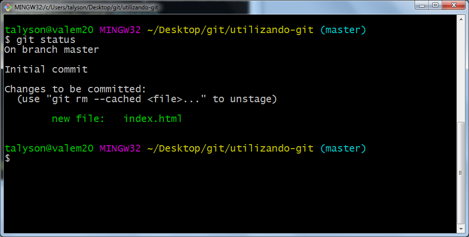
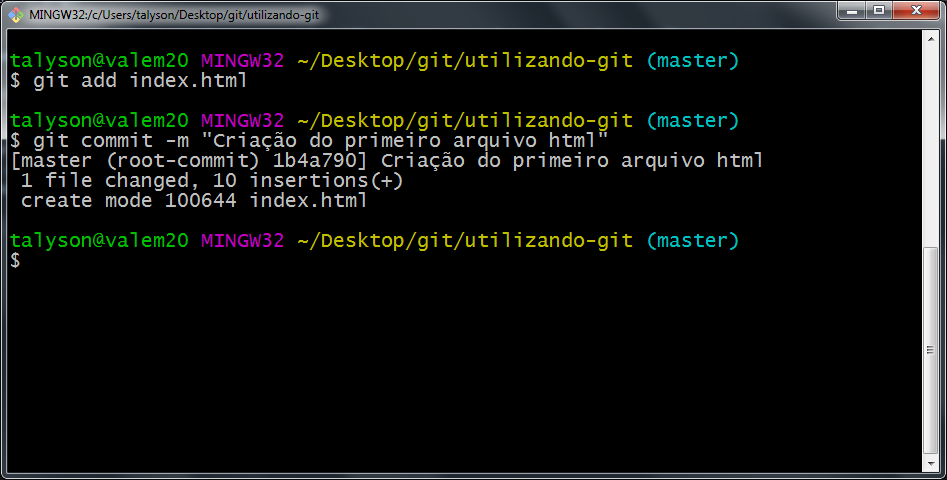

# Ciclo básico Git

O Git como já foi dito é uma ferramenta para versionamento e gerenciamento de código fonte 
(Caso ainda não tenha visto [clique aqui](GitInstall.md)), e respeita diversos procedimentos para garantir um bom funcionamento e utilização da ferramenta.

### Importante!

Neste exemplo utilizaremos o terminal Git ou também conhecido como Git Bash para se entender o ciclo, eu pessoalmente prefiro o Bash pelo fato de que todas as operações serão manuais, o que nos permite ter maior controle e entendimento acerca dos processos. E por fim lembre-se **Sempre utilize a palavra git antes dos comandos a serem realizados**.

## Clonando o repositório remoto para o computador

Ao se trabalhar com plataformas como GitHub ou Bitbucket, temos que trazer todos os arquivos que compõe o projeto para o nosso computador, além de trazer uma cópia local do projeto, cria um vínculo do repositório local com o remoto fazendo com que toda nova mudança feita no projeto seja percebida e controlada através do Git.

1º Passo - Clique com o botão direito em um local de sua preferência e clique em Git Bash Here.

2º Passo - Com o terminal aberto digite o comando **git clone** seguido do endereço do repositório, esse endereço se encontra salvo dentro do GitHub ou Bitbucket e terá um caminho parecido com: "https://github.com/talysonrafael/utilizando-git.git".

Agora temos a confirmação de que o repositório foi clonado.

## Utilizando o Git

Agora poderemos usar a ferramenta para conseguir fazer e controlar modificações dentro do projeto.

### Importante

**Todos os dias antes de programar ou modificar qualquer coisa em nosso projeto, devemos utilizar o comando GIT PULL, pois através desse comando é verificado possíveis novas alterações que foram feitas e traze-las para o seu repositório local, isso evita diversos conflitos e potenciais problemas no desenvolvimento do projeto**

Ao criar ou modificar qualquer programa dentro de nosso projeto, o Git ferramenta responsável por controlar as modificações do nosso projeto identifica essas modificações, e existe um comando bastante útil para verificar o estados desses arquivos. Utilizamos o comando **(git status)**.

No exemplo acima criei um arquivo html em meu repositório, e ele identificou a modificação e me mostrou o arquivo em vermelho, agora temos que adicionar esse arquivo para ser enviado ao meu repositório remoto com o comando **git add**, aqui temos duas opções, ou podemos utilizar o comando **git add .** ou o comando **git add nomeDoArquivo.extensão**, no primeiro caso ele adiociona todos os arquivos modificados do projeto, e no segundo conseguimos definir apenas qual ou quais arquivos queremos selecionar para serem enviados ao repositório, vamos utilizar o segundo exemplo conforme abaixo.

Ao executar o comando **git status** novamente, vamos identificar que o arquivo passou de vermelho para verde o que indica que ele está pronto para ser comentado ou *commitado*, vejamos na imagem abaixo.

Agora iremos comentar as alterações que fizemos no nosso projeto, esse comentário é importante para identificar o autor das modificações e por conter uma descrição do que foi efetivamente alterado, facilitando a procura de possíveis erros e na comunicação dentro do projeto. O comando para comentar essas alterações é o *git commit -m "Descrição da sua alteração"*
como no exemplo abaixo.

Agora com o arquivo comentado com as suas devidas alterações ele está pronto para ser enviado ao repositório remoto, esse comando vai atualizar o repositório remoto com todas as alterações efetuadas, o comando para essa tarefa é o **git push**, vejamos na imagem abaixo. Esse é o ciclo básico Git com todas as funcionalidades mais básicas da ferramenta.

