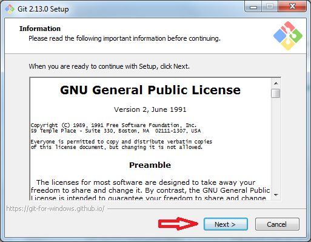
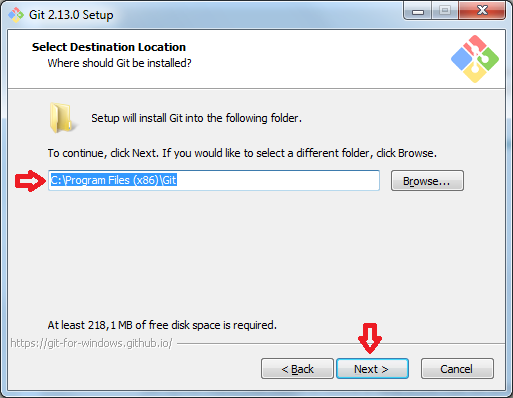
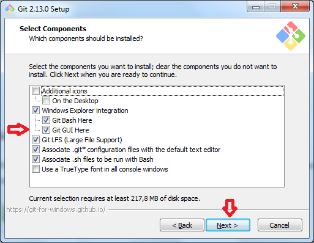
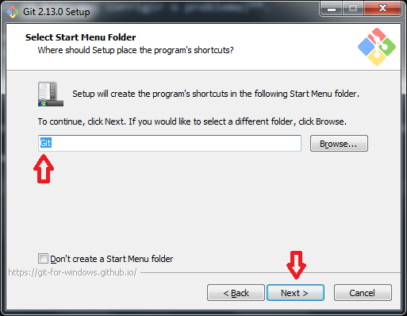
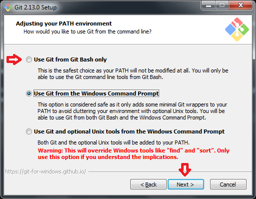
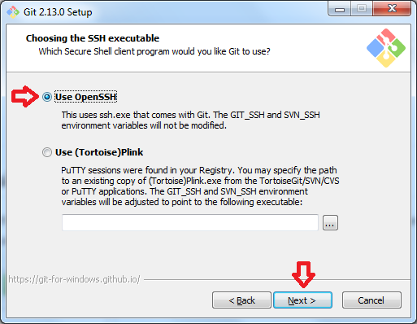
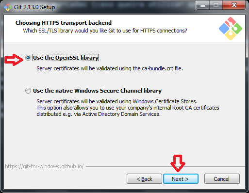
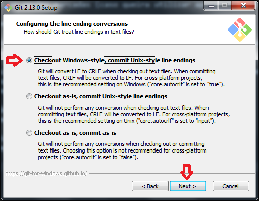
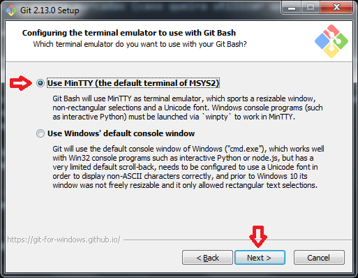
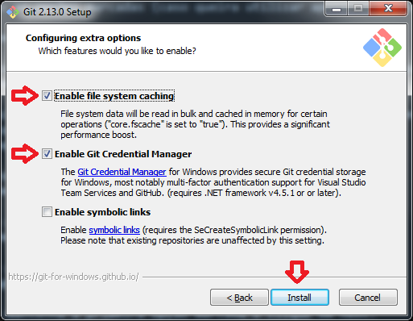

# Git

## Introdução.

Git é um sistema de controle de versão distribuído e um sistema de gerenciamento de código fonte. O Git foi inicialmente projetado e desenvolvido por [Linus Torvalds](https://pt.wikipedia.org/wiki/Linus_Torvalds) para o desenvolvimento do kernel Linux, mas foi adotado por muitos outros projetos.

O Git é um software livre, distribuído sob os termos  da GNU. Sua manutenção é atualmente supervisionada por [Junio Hamano](https://pt.wikipedia.org/wiki/Junio_Hamano).

## Instalação e configuração

É imprenscindível a instalação de algum cliente Git para a utilização da ferramenta. Abaixo segue um exemplo para a instalação. Neste exemplo será utilizado o programa padrão disponibilizado no site oficial do Git [link aqui](https://git-scm.com/), e a instalação poderá ser feita em qualquer ambiente Windows a partir da versão 7.

1º passo - Faça o download do instalador **(Se o seu S.O. for baseado em 64 bits e o programa apresentar travamentos, a instalação da versão de 32 bits vai corrigir o problema)**.

2º passo - Clique em next.

3º passo - Selecione o local de instalação (recomendo o padrão) e clique em next.

4º passo - Deixe todas as opções marcadas (caso queira utilizar apenas o terminal do cliente Git, desmarque a opção Git GUI Here).

5º passo - Selecione o local para criação dos atalhos (novamente recomendo o padrão) e clique em next.

6º passo - Deixe a opção padrão marcada (Caso queira utilizar comandos Git apenas no terminal do cliente Git, marque a primeira opção) e clique em next.

7ºpasso - Mantenha a opção "Use OpenSSH" marcada e clique em next.

8º passo - Mantenha a primeira opção marcada e clique em next.

9º passo - Mantenha a primeira opção marcada e clique em next.

10º passo - Novamente mantenha a primeira opção marcada e clique em next.

11º passo - Mantenha as duas primeiras opções marcadas e clique em install.

## Configuração inicial no Git

Após a instalação concluída abra o console Git Bash, e digite as seguintes configurações: **git config --global user.name "Seu nome" e logo após digite o segundo comando **git config --global user.email "seu-email@seudominio.com", como na imagem abaixo.

